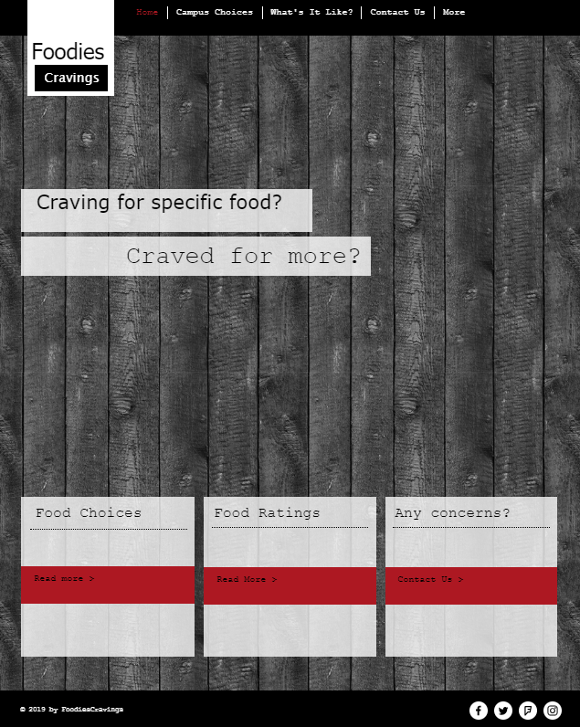
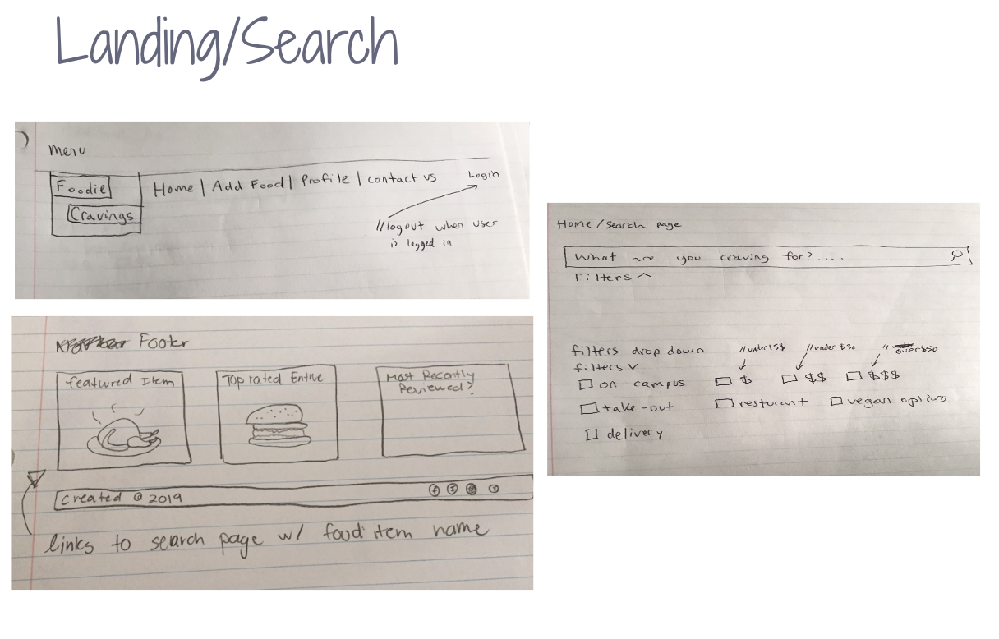
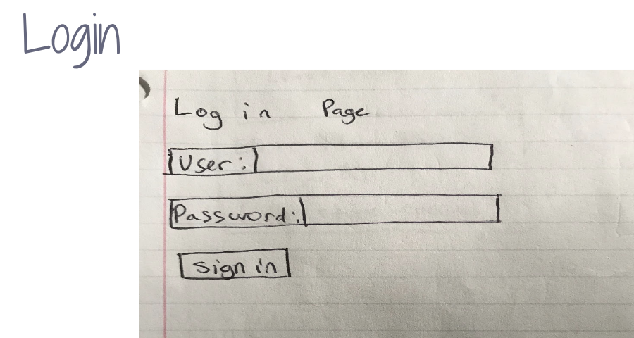
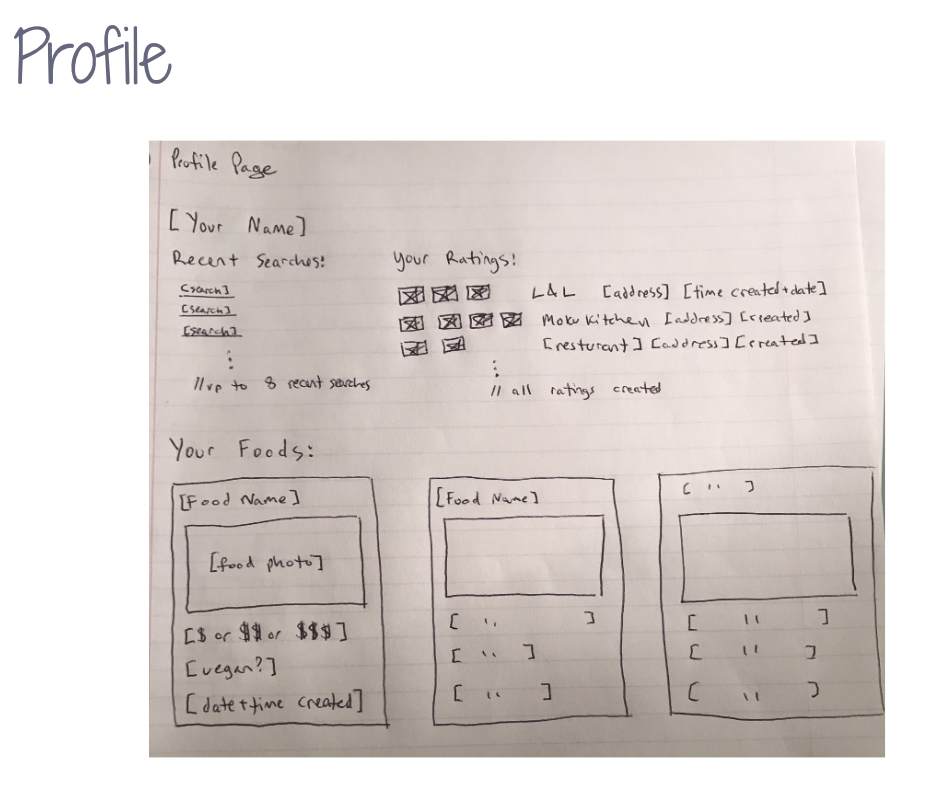
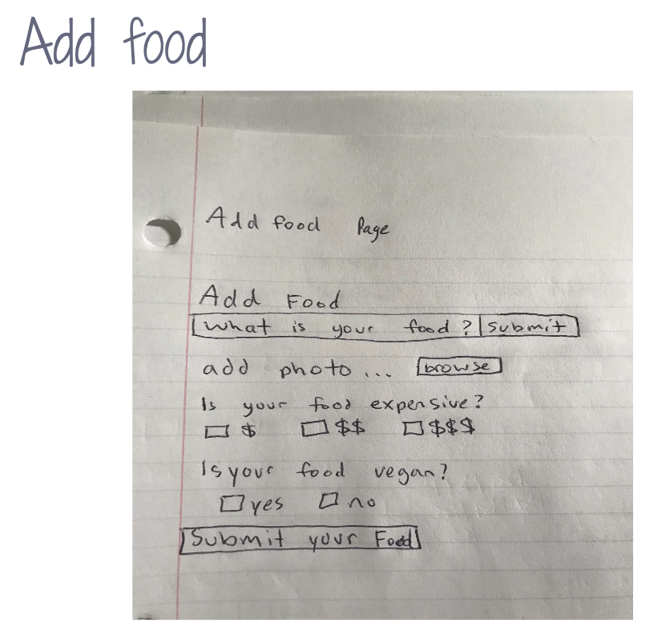
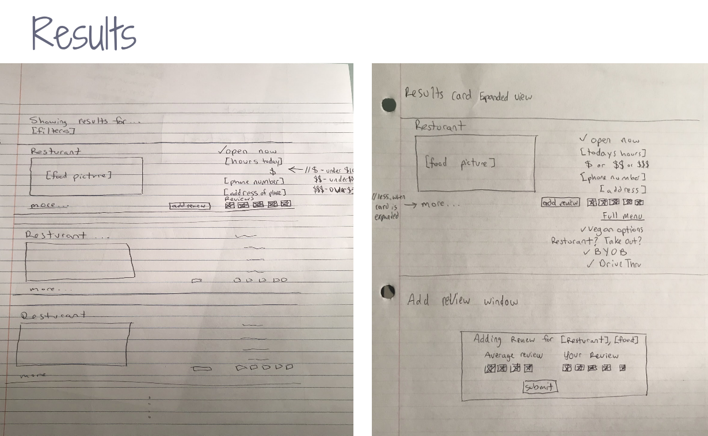

## Quick Links
[Foodie Cravings Repository](https://github.com/foodiecravings/foodiecravings.github.io)

[Project Board](https://github.com/foodiecravings/foodiecravings/projects)

[FoodieCravings App](http://foodiecravings.meteorapp.com/#/)

## Our Goals
We hope to create a website that can help everyone feed their cravings. Our website will be able to collect
information from campus restaurants. Some information that we plan to share with our users is the location, the 
hours of operation, some visual aids, the price of the food, and the ability to add ratings for others to see.

## Track our Deployment
[Milestone 1](https://github.com/foodiecravings/foodiecravings/projects/1)

[Milestone 2](https://github.com/foodiecravings/foodiecravings/projects/2)

## About FoodiesCravings

## Page Mock Ups
Here at Foodie Cravings, we know how hungry you are and what your craving. We provide an easy to use application where you may search your top favorite entrees and get results we know you'll enjoy.

After logging in/signing up, students are able to customize their profile page where they are able to keep track of their top favorite entrees, recent searches, and their all time reviews.

Students may be able to search and add their favorite foods to their profile!

So why don't you come pay us a visit and indulge in your deepest cravings.

