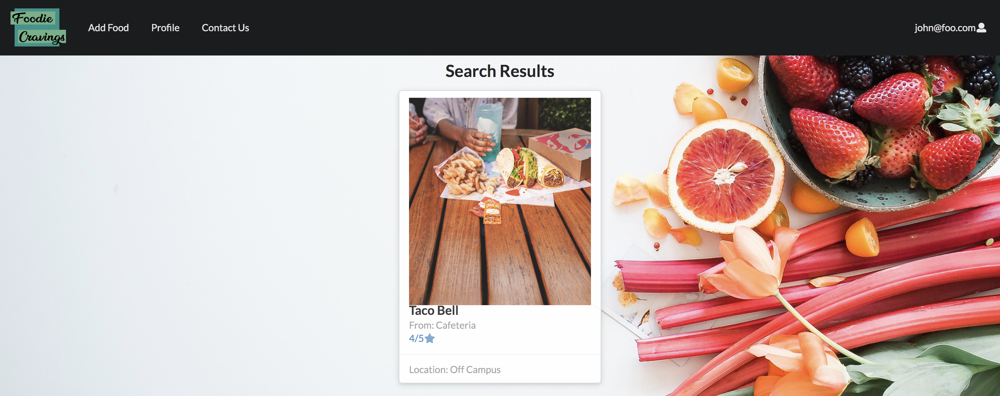
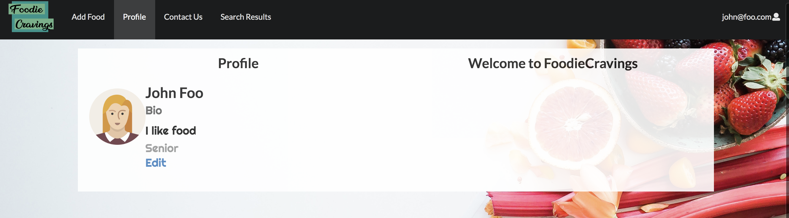

# Table of contents

* [Useful Links](#useful-links)
* [Overview](#overview)
* [User Guide](#user-guide)
* [Community Feedback](#community-feedback)
* [Installation](#installation)
* [Application design](#application-design)
  * [Directory structure](#directory-structure)
  * [Import conventions](#import-conventions)
  * [Naming conventions](#naming-conventions)
  * [Data model](#data-model)
  * [CSS](#css)
  * [Configuration](#configuration)
  * [Quality Assurance](#quality-assurance)
    * [ESLint](#eslint)
* [FoodieCravings Website](#foodiecravings-website)
 * [Milestone development](#milestone-development)
  * [Milestone 1: Mockup development](#milestone-1-mockup-development)
  * [Milestone 2: Improve Functionality](#milestone-2-improve-functionality)
  * [Milestone 3: Clean Up](#milestone-3-clean-up)


## Useful Links
[FoodieCravings Website](http://foodiecravings.meteorapp.com/#/)

[Milestone1](https://github.com/foodiecravings/foodiecravings/projects/1)

[Milestone 2](https://github.com/foodiecravings/foodiecravings/projects/2)

[Milestone 3](https://github.com/foodiecravings/foodiecravings/projects/3)

[Project Board](https://github.com/foodiecravings/foodiecravings/projects)

[GitHub Repository](https://github.com/foodiecravings/foodiecravings)

[GitHub Organization](https://github.com/foodiecravings)

## Overview
Ever having a craving for food but you don't know where to get the best of the best? Well youre in luck! Foodie Cravings 
hopes to create a website that can help the UH community feed their cravings. Our website is able to collect information 
from campus restaurants and even locations off campus. Some information that Foodie Cravings shares with our users is
the location, visual aids, price, and ratings. You can check out our [repository](https://github.com/foodiecravings/foodiecravings) as well as our live [website](http://foodiecravings.meteorapp.com/#/)! Here are links to our recent updates in our [Milestone1](https://github.com/foodiecravings/foodiecravings/projects/1), [Milestone2](https://github.com/foodiecravings/foodiecravings/projects/2), and [Milestone3](https://github.com/foodiecravings/foodiecravings/projects/3)
project boards!

## User Guide
Navigate over to our [website](http://foodiecravings.meteorapp.com/#/) and you will arrive at our landing page.

From here you will need to set up an account. You can do this by clicking the login button at the very top right 
and then selecting sign up. 


After entering your information you will now have full access to our website! 

You can add new ratings by navigating to the "Add Food" tab on top. Here we will ask you for your review of the food. 

There is also a page where you can search for food, this is under the "Search Results" tab. 



The last special feature is your profile page. Here is where other reviews can get to know a little bit more about you! 


Your profile page will also allow you to view the reviews you made and foods you favorited


If you have admin access, you will have access to a page that allows you to see any reports that were made to the site


# Community Feedback
Here are some reviews that we collected from the community:

"Very good application, a little glitchy in some areas but overall the design and the implementation of the widgets are 
good." - Jianna O.

"Love the designs of the user interface. Very colorful and eye-catching. Very easy to use the website." - Kyle D.

"Good idea, but doesn’t yelp exist? UI otherwise is nice and easy to use." - Emily K.

"Design is good but there is a slight delay on the submit button." - Anonymous

"The website works in a way, but does not work entirely but overall design and concept looks great."  - Anonymous

Our take away from the community feedback is that we have a great design and concept. The UI is very user friendly.
There are many things that are functional but, there are other things that are not. Theses are issues that we will have
to address in the future. 

# Installation

First, [install Meteor](https://www.meteor.com/install).

Second, [download a copy of FoodieCravings](https://github.com/foodiecravings/foodiecravings.git), or clone it using git.
  
Third, cd into the app/ directory and install libraries with:

```
$ meteor npm install
```

Fourth, run the system with:

```
$ meteor npm run start
```

Finally, run this last line to import a package for one of our features requirements:

```
$ npm install react-image-fallback
```

If all goes well, the application will appear at [http://localhost:3000](http://localhost:3000). 

# Application Design

## Directory structure

The top-level directory structure contains:

```
app/        # holds the Meteor application sources
config/     # holds configuration files, such as settings.development.json
.gitignore  # don't commit IntelliJ project files, node_modules, and settings.production.json
```

This structure separates configuration files (such as the settings files) in the config/ directory from the actual Meteor application in the app/ directory.

The app/ directory has this top-level structure:

```
client/
  lib/           # holds Semantic UI files.
  head.html      # the <head>
  main.js        # import all the client-side html and js files. 

imports/
  api/           # Define collection processing code (client + server side)
    base/
    interest/
    profile/
  startup/       # Define code to run when system starts up (client-only, server-only)
    client/        
    server/        
  ui/
    components/  # templates that appear inside a page template.
    layouts/     # Layouts contain common elements to all pages (i.e. menubar and footer)
    pages/       # Pages are navigated to by FlowRouter routes.
    stylesheets/ # CSS customizations, if any.

node_modules/    # managed by Meteor

private/
  database/      # holds the JSON file used to initialize the database on startup.

public/          
  images/        # holds static images for landing page and predefined sample users.
  
server/
   main.js       # import all the server-side js files.
```

## Import conventions

This system adheres to the Meteor 1.4 guideline of putting all application code in the imports/ directory, and using client/main.js and server/main.js to import the code appropriate for the client and server in an appropriate order.

This system accomplishes client and server-side importing in a different manner than most Meteor sample applications. In this system, every imports/ subdirectory containing any Javascript or HTML files has a top-level index.js file that is responsible for importing all files in its associated directory.   

Then, client/main.js and server/main.js are responsible for importing all the directories containing code they need. For example, here is the contents of client/main.js:

```
import '/imports/startup/client';
import '/imports/ui/components/form-controls';
import '/imports/ui/components/directory';
import '/imports/ui/components/user';
import '/imports/ui/components/landing';
import '/imports/ui/layouts/directory';
import '/imports/ui/layouts/landing';
import '/imports/ui/layouts/shared';
import '/imports/ui/layouts/user';
import '/imports/ui/pages/directory';
import '/imports/ui/pages/filter';
import '/imports/ui/pages/landing';
import '/imports/ui/pages/user';
import '/imports/api/base';
import '/imports/api/profile';
import '/imports/api/interest';
import '/imports/ui/stylesheets/style.css';
```

Apart from the last line that imports style.css directly, the other lines all invoke the index.js file in the specified directory.

We use this approach to make it more simple to understand what code is loaded and in what order, and to simplify debugging when some code or templates do not appear to be loaded.  In our approach, there are only two places to look for top-level imports: the main.js files in client/ and server/, and the index.js files in import subdirectories. 

Note that this two-level import structure ensures that all code and templates are loaded, but does not ensure that the symbols needed in a given file are accessible.  So, for example, a symbol bound to a collection still needs to be imported into any file that references it. 
 
## Naming conventions

This system adopts the following naming conventions:

  * Files and directories are named in all lowercase, with words separated by hyphens. Example: accounts-config.js
  * "Global" Javascript variables (such as collections) are capitalized. Example: Profiles.
  * Other Javascript variables are camel-case. Example: collectionList.
  * Routes to pages are named the same as their corresponding page. Example: Directory_Page.


## Data model

The FoodieCravings data model is implemented by four Javascript classes: [FoodCollection](https://github.com/foodiecravings/foodiecravings/blob/master/app/imports/api/food/food.js), [ReportCollection](https://github.com/foodiecravings/foodiecravings/blob/master/app/imports/api/report/report.js), [NoteCollection](https://github.com/foodiecravings/foodiecravings/blob/master/app/imports/api/note/note.js), and [ProfileCollection](https://github.com/foodiecravings/foodiecravings/blob/master/app/imports/api/profile/profile.js)
* Food collection is the data of food where users are able to view in the system.
* Report collection is added where users may provide feedback to the admins.
* Note collection is to track users comments on food reviews.
* Profile collection is used to track the data for users profiles.

## CSS

The application uses the [Semantic UI](http://semantic-ui.com/) CSS framework. To learn more about the Semantic UI theme integration with Meteor, see [Semantic-UI-Meteor](https://github.com/Semantic-Org/Semantic-UI-Meteor).

## Configuration

The [config](https://github.com/foodiecravings/foodiecravings/tree/master/config) directory is intended to hold settings files.  The repository contains one file: [config/settings.development.json](https://github.com/foodiecravings/foodiecravings/blob/master/config/settings.development.json).

The [.gitignore](https://github.com/foodiecravings/foodiecravings/blob/master/.gitignore) file prevents a file named settings.production.json from being committed to the repository. So, if you are deploying the application, you can put settings in a file named settings.production.json and it will not be committed.

## Quality Assurance

### ESLint

FoodieCravings includes a [.eslintrc](https://github.com/foodiecravings/foodiecravings/blob/master/app/.eslintrc) file to define the coding style adhered to in this application. You can invoke ESLint from the command line as follows:

```
meteor npm run lint
```

ESLint should run without generating any errors.  

It's significantly easier to do development with ESLint integrated directly into your IDE (such as IntelliJ).

# FoodieCravings Website

[FoodieCravings App](http://foodiecravings.meteorapp.com/#/)

# Milestone Development
## Milestone 1: Mockup Development
This milestone started on April 4, 2019 and ended on April 11, 2019.

Our task for [milestone 1](https://github.com/foodiecravings/foodiecravings/projects/1)

- Create a fully functional [landing page](http://foodiecravings.meteorapp.com/#/) with working navbar and footer and allows users to know what our website is about

- Create a [contact us](http://foodiecravings.meteorapp.com/#/contact) page where users can provide feedback where admins may use to fix the website. Admins will also have the ability to look at the reports that are submitted through the Contact Us page.


- Add functionality to search bar on [landing page](http://foodiecravings.meteorapp.com/#/)


- Add [log in](http://foodiecravings.meteorapp.com/#/signin) page to allow user to log in and add in their food


Milestone 1 consisted of 10 issues

Each issue was implemented in its own branch, and merged into master when completed

## Milestone 2: Improve Functionality
This milestone started on April 12, 2019 and ended on April 25, 2019.

Our task for [milestone 2](https://github.com/foodiecravings/foodiecravings/projects/2)

- Add a [profile page](http://foodiecravings.meteorapp.com/#/profile) so the user can share a little information about them


- A list of your food reviews is also available on your profile page. There are also options to add on comments, delete or edit your reviews


Milestone 2 consisted of 8 issues

Each issue was implemented in its own branch, and merged into master when completed

## Milestone 3: Clean Up
This milestone started on April 26, 2019 and ended on May 2, 2019.

Our Task for [milestone 3](https://github.com/foodiecravings/foodiecravings/projects/3)

- Complete our [search bar](http://foodiecravings.meteorapp.com/#/) functionality


- The Search bar will take you to a page to list its results


- Implement a favorite system on the [profile page](http://foodiecravings.meteorapp.com/#/profile) 


- Fix and improve functionality of the overall system. Some of these fixes included the profile page, list results page,
and removing any unused files

Milestone 3 consisted of 11 issues

Each issue was implemented in its own branch, and merged into master when completed
